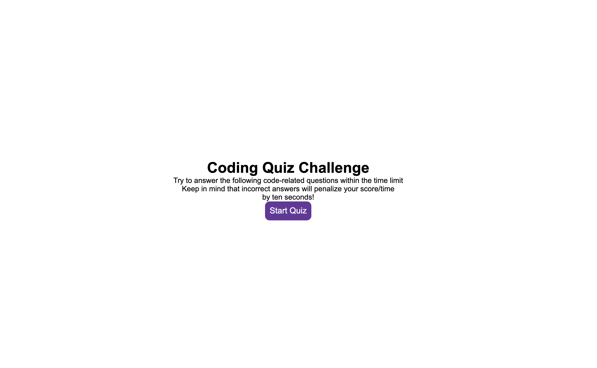

# Quiz

# Description
Quiz is a javascrip and html based project. When clickiing start user will be ask couple of questions with 4 different choices.  User will click on answer they think is right and if it is right it will increase score. If wrong 10 seconds will be deducted from the timer. if user does not finish on time questions will end. At the end score is saved and user is prompt to set their initials.

## Installation

Go to my repository (https://github.com/cesarrr93/quiz) download or clone using the command "git clone <repositorylink>" 

## Usage

```
Open in terminal and click on the html folder and select open in default browser. Click start quiz and enjoy!
```

## Contributing
Pull requests are welcome. For major changes, please open an issue first to discuss what you would like to change.

Please make sure to update tests as appropriate.

## License
[MIT](https://choosealicense.com/licenses/mit/)

# ScreenShot
